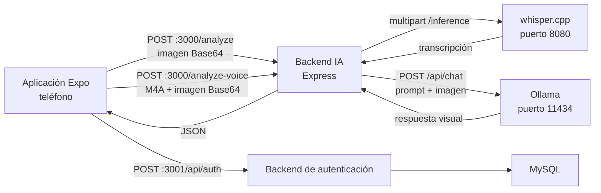

# VERIA — contexto técnico completo para continuar el desarrollo

## 1. Objetivo del proyecto

VERIA es una aplicación móvil de asistencia visual para personas con baja visión.
La cámara captura el entorno y un modelo de visión ejecutado con Ollama devuelve
una descripción breve en español. La aplicación también permite mantener
presionado un botón de micrófono, dictar una instrucción como “busca mis llaves”
y soltarlo para:

1. detener la grabación;
2. capturar la imagen actual;
3. transcribir el audio localmente con whisper.cpp;
4. enviar la transcripción y la imagen al modelo visual de Ollama;
5. mostrar y leer la respuesta en voz alta.

Todo el procesamiento de IA está diseñado para ejecutarse en la computadora
local. El teléfono y la computadora deben estar en la misma red.

## 2. Estado actual resumido

- Aplicación móvil: Expo SDK 56, React Native y React Navigation.
- Cámara y captura Base64: `expo-camera`.
- Grabación de voz: `expo-audio`.
- Envío multipart nativo del archivo M4A: `File.upload()` de
  `expo-file-system`.
- Texto a voz: `expo-speech`.
- Retroalimentación táctil: `expo-haptics`.
- Backend de IA: Express en el puerto `3000`.
- Transcripción: whisper.cpp en `127.0.0.1:8080`.
- Modelo Whisper instalado: `whisper/Release/models/ggml-small.bin`.
- Modelo visual: `minicpm-v:latest` mediante Ollama en `127.0.0.1:11434`.
- Backend de autenticación separado: Express y MySQL en el puerto `3001`.
- IP local configurada para el teléfono: `192.168.1.11`.

La documentación de Expo que debe consultarse antes de modificar código es la
versión exacta del proyecto:

- https://docs.expo.dev/versions/v56.0.0/
- https://docs.expo.dev/versions/v56.0.0/sdk/audio/
- https://docs.expo.dev/versions/v56.0.0/sdk/camera/

## 3. Arquitectura de ejecución



### Puertos

| Servicio                 | Dirección           | Uso                               |
| ------------------------ | ------------------- | --------------------------------- |
| Expo/Metro               | `192.168.1.11:8081` | Entrega el proyecto a Expo Go     |
| Backend de IA            | `0.0.0.0:3000`      | Recibe imágenes y comandos de voz |
| Backend de autenticación | `0.0.0.0:3001`      | Login y registro                  |
| whisper.cpp              | `127.0.0.1:8080`    | Speech-to-text local              |
| Ollama                   | `127.0.0.1:11434`   | Modelo de visión local            |

Whisper y Ollama solamente necesitan aceptar conexiones locales porque el
backend de IA se ejecuta en la misma computadora. El backend del puerto `3000`
sí escucha en todas las interfaces para que el teléfono pueda alcanzarlo.

## 4. Estructura importante del repositorio

```text
C:\capstone
├── index.js                         Entrada de Expo
├── app\App.js                       Componente raíz
├── app.json                         Permisos y plugins nativos
├── package.json                     Dependencias de la app
├── navigator\Application_nav.js     Navegación principal
├── screens\
│   ├── Welcome.jsx                  Pantalla inicial
│   ├── Login.jsx                    Inicio de sesión
│   ├── SignIn.jsx                   Registro
│   ├── CameraScreen.jsx             Núcleo de cámara, voz y accesibilidad
│   ├── Settings.jsx                 Menú de ajustes
│   ├── Accessibility.jsx            Ajustes visuales aún no integrados
│   ├── Interface.jsx                Ajustes visuales aún no integrados
│   └── feedback.jsx                 Ajustes hápticos aún no integrados
├── config\ollama.js                 URL del backend de IA
├── services\ollama.js               Cliente HTTP de análisis visual
├── services\auth.js                 Cliente HTTP de autenticación
├── backend\
│   ├── index.js                     API de imagen, voz, Whisper y Ollama
│   └── package.json                 Dependencias del backend de IA
├── dbconfig\
│   ├── server.js                    API de autenticación
│   ├── auth.js                      Rutas login/register
│   ├── controller.js                Lógica de usuarios y bcrypt
│   ├── db.js                        Pool de MySQL
│   └── validation.js                Validaciones actualmente desconectadas
├── hooks\usePhysicalRightPosition.js
│                                      Hook de orientación actualmente sin uso
├── assets\
│   ├── ICON_CAMERA.png              Icono del botón de cámara
│   ├── LOGO_2.png                   Logo de bienvenida
│   └── ...                          Iconos de Expo/Android
└── whisper\Release\
    ├── whisper-server.exe           Servidor de transcripción
    ├── DLL requeridas
    └── models\ggml-small.bin         Modelo multilingüe
```

## 5. Inicio de la aplicación y navegación

### `index.js`

Importa `app/App.js` y registra el componente raíz mediante
`registerRootComponent`. Esto permite ejecutar la aplicación tanto en Expo Go
como en un build nativo.

### `app/App.js`

Envuelve la aplicación en `SafeAreaProvider` y renderiza `AppNavigator`.
Actualmente importa `StatusBar`, `NavigationContainer` y
`createNativeStackNavigator`, pero esos tres imports no se utilizan aquí.

### `navigator/Application_nav.js`

Define un `NativeStackNavigator`. La ruta inicial es `Welcome`.

Flujo de navegación:

```text
Welcome
  └─ después de 7 segundos → Login
       ├─ login correcto → Camera
       └─ Register → registro correcto → Login

Camera
  └─ Settings
       ├─ Accessibility
       ├─ Interface
       ├─ Feedback
       └─ Log Out → Welcome
```

No existe todavía un estado global de sesión. Llegar a `Camera` solo depende de
la navegación después de que el servidor responda al login.

## 6. Pantallas

### `screens/Welcome.jsx`

- Muestra `assets/LOGO_2.png`, el nombre VERIA y “Cargando...”.
- Crea un temporizador de 7 segundos.
- Usa `navigation.replace("Login")`, por lo que elimina Welcome del historial.
- Limpia el temporizador al desmontarse.

### `screens/Login.jsx`

Estado local:

- `correo`
- `contrasena`

Antes de enviar:

- comprueba que ambos campos tengan contenido;
- valida el correo con una expresión regular.

Solicitud actual:

```http
POST http://192.168.1.11:3001/api/auth/login
Content-Type: application/json

{
  "correo": "usuario@ejemplo.com",
  "contrasena": "Password123!"
}
```

Si el servidor responde correctamente, muestra una alerta y reemplaza la ruta
actual por `Camera`. No guarda token, usuario ni sesión.

### `screens/SignIn.jsx`

Estado local:

- `nombre`
- `correo`
- `contrasena`
- `confirmarContrasena`

Validaciones:

- todos los campos son obligatorios;
- formato básico de correo;
- mínimo 8 caracteres;
- una mayúscula;
- una minúscula;
- un número;
- un carácter especial;
- ambas contraseñas deben coincidir.

Solicitud:

```http
POST http://192.168.1.11:3001/api/auth/register
Content-Type: application/json

{
  "nombre": "Nombre",
  "correo": "usuario@ejemplo.com",
  "contrasena": "Password123!"
}
```

Después del registro vuelve a `Login`.

### `screens/Settings.jsx`

Es un menú que abre las pantallas Accessibility, Interface y Feedback. El botón
Log Out solo navega a Welcome; no elimina token ni sesión porque actualmente no
se guarda ninguno.

### `screens/Accessibility.jsx`

Tiene switches locales para:

- TalkBack Mode;
- Detailed Descriptions.

Estos valores se pierden al salir de la pantalla y todavía no modifican
`CameraScreen`, el prompt ni el comportamiento de accesibilidad.

### `screens/Interface.jsx`

Tiene estado local para:

- tamaño de botón: Small, Medium o Large;
- Minimal Mode;
- High Contrast.

Actualmente solo cambia la apariencia de los controles dentro de esta pantalla.
No se persiste y no afecta la cámara.

### `screens/feedback.jsx`

Tiene:

- switch para activar vibración;
- slider de intensidad de 0 a 100.

No se persiste y todavía no controla `expo-haptics`.

## 7. Núcleo de cámara: `screens/CameraScreen.jsx`

Este es el módulo más importante de la aplicación.

### Dependencias utilizadas

- React: estado, referencias, efectos y callbacks.
- React Native: interfaz, accesibilidad, imágenes y botones.
- `expo-camera`: vista de cámara, permisos y captura.
- `expo-audio`: permiso, sesión y grabación del micrófono.
- `expo-haptics`: vibración de selección, éxito y advertencia.
- `expo-screen-orientation`: desbloquea orientación mientras la cámara está
  abierta y vuelve a retrato al salir.
- `expo-speech`: lee descripciones en español.
- `react-native-safe-area-context`: separa los botones del borde inferior.
- `services/ollama.js`: envía imagen o audio+imagen al backend.

### Constantes

- `MAX_CAPTURE_SIDE = 720`: intenta elegir una resolución cuya dimensión más
  grande no supere 720 píxeles.
- `DOUBLE_PRESS_DELAY_MS = 300`: ventana para reconocer doble pulsación.

### Selección de resolución

`parsePictureSize(size)` convierte textos como `1280x720` en dimensiones
numéricas.

`pickPictureSize(sizes)`:

1. convierte y valida los tamaños;
2. los ordena de mayor a menor;
3. elige el mayor que no supere 720 píxeles;
4. si ninguno cumple, usa el más pequeño disponible.

Esto reduce el peso de la imagen enviada en Base64 y el tiempo de análisis.

### Referencias (`useRef`)

| Referencia          | Responsabilidad                                            |
| ------------------- | ---------------------------------------------------------- |
| `cameraRef`         | Acceso imperativo a `CameraView`                           |
| `audioRecorder`     | Grabador administrado por `expo-audio`                     |
| `voicePressHeldRef` | Indica si el dedo sigue sobre el botón de voz              |
| `voiceRecordingRef` | Indica si realmente comenzó la grabación                   |
| `activeRequestRef`  | Guarda el `AbortController` de la petición actual          |
| `captureRunRef`     | Identificador incremental para invalidar respuestas viejas |
| `pressTimerRef`     | Temporizador de pulsación simple/doble                     |

`voicePressHeldRef` evita un caso importante: si aparece el diálogo de permiso
del micrófono y el usuario suelta el botón antes de responder, la aplicación no
debe empezar a grabar después.

`captureRunRef` evita condiciones de carrera. Si una operación se cancela o se
inicia otra, cualquier respuesta tardía con un identificador anterior se ignora.

### Estado (`useState`)

| Estado             | Uso                                          |
| ------------------ | -------------------------------------------- |
| `permission`       | Estado del permiso de cámara                 |
| `cameraReady`      | Habilita botones cuando la cámara está lista |
| `pictureSize`      | Resolución seleccionada                      |
| `capturedPhotoUri` | Vista congelada mientras se procesa          |
| `isProcessing`     | Muestra indicador y bloquea voz              |
| `statusMessage`    | Mensaje visible y accesible                  |
| `lastDescription`  | Última respuesta para repetirla              |
| `hasError`         | Cambia el panel a color de error             |
| `isVoiceRecording` | Cambia visualmente el botón de micrófono     |

### Efecto de montaje

Al entrar:

- desbloquea la orientación.

Al salir:

- limpia el temporizador;
- cancela la petición activa;
- detiene el texto a voz;
- bloquea la orientación en retrato.

### `announce(message)`

Hace dos cosas:

1. actualiza el mensaje mostrado;
2. usa `AccessibilityInfo.announceForAccessibility` para que TalkBack o
   VoiceOver lo anuncien.

### `vibrate(type)`

- `selection`: vibración ligera.
- `success`: notificación háptica de éxito.
- `cancel`: notificación háptica de advertencia.

Los errores hápticos se ignoran deliberadamente para que una falla de vibración
no interrumpa la función principal.

### `cancelCurrentAction()`

- incrementa `captureRunRef`;
- aborta la petición HTTP;
- detiene la voz;
- limpia estados de imagen, descripción y procesamiento;
- vibra como advertencia;
- anuncia la cancelación.

### `rereadDescription()`

Si existe una descripción:

- detiene cualquier lectura anterior;
- anuncia que se repetirá;
- llama `Speech.speak` con idioma `es-MX` y velocidad `0.8`.

Si no existe, lo anuncia.

### `handleCameraReady()`

Obtiene las resoluciones disponibles y selecciona una mediante
`pickPictureSize`. Aun si falla la consulta, marca la cámara como lista usando la
resolución predeterminada.

### Flujo de captura normal: `handleCapture()`

1. Verifica que la cámara esté lista.
2. Cancela una petición anterior y detiene la voz.
3. Crea un nuevo `AbortController` e identificador de ejecución.
4. Activa el estado de procesamiento.
5. Captura una foto:

```js
{
  base64: true,
  quality: 0.25,
  shutterSound: true
}
```

6. Conserva la URI para congelar visualmente la imagen.
7. Llama `analyzeImageWithBackend(photo.base64, signal)`.
8. Guarda la descripción.
9. Vibra como éxito.
10. Lee la descripción mediante `expo-speech`.
11. Ignora el resultado si la operación fue cancelada.
12. Muestra errores accesibles y limpia `isProcessing` al terminar.

### Inicio de voz: `startVoiceCommand()`

Se ejecuta con `onPressIn`.

1. Comprueba que la cámara esté lista y no haya otra operación.
2. Marca que el botón sigue presionado.
3. Solicita permiso de micrófono.
4. Configura la sesión:

```js
{
  playsInSilentMode: true,
  allowsRecording: true
}
```

5. Prepara el grabador con `RecordingPresets.HIGH_QUALITY`.
6. Comprueba nuevamente que el dedo siga presionando.
7. Inicia la grabación.
8. Vibra y anuncia “Escuchando”.

### Fin de voz: `finishVoiceCommand()`

Se ejecuta con `onPressOut`.

1. Marca que el botón dejó de estar presionado.
2. Verifica que la grabación sí haya comenzado.
3. Detiene el archivo de audio.
4. Captura una foto sin sonido.
5. Lee el archivo `.m4a` como Base64.
6. Envía audio e imagen mediante
   `analyzeVoiceCommandWithBackend`.
7. Recibe:

```json
{
  "transcription": "busca mis llaves",
  "result": "Las llaves están sobre la mesa, junto al vaso."
}
```

8. Anuncia la transcripción y la respuesta.
9. Lee solamente la respuesta final con `expo-speech`.
10. Desactiva el modo de grabación de audio.

### Gestos del botón principal

`handleButtonPress()` espera 300 ms para distinguir:

- doble pulsación: cancela la operación o descripción actual;
- pulsación simple sin descripción: captura y analiza una imagen;
- pulsación simple con descripción previa: repite la descripción.

Para tomar una imagen nueva después de obtener una descripción, actualmente hay
que hacer doble pulsación para limpiar y después una pulsación para capturar.

### Componentes visuales

- `CameraView` ocupa toda la pantalla y usa la cámara trasera.
- Mientras procesa, la foto capturada se coloca sobre la cámara.
- Un overlay muestra `ActivityIndicator` y el estado.
- El botón central usa `assets/ICON_CAMERA.png`.
- El botón derecho inicia voz al presionar y termina al soltar.
- El botón superior derecho navega a Settings.

## 8. Cliente HTTP: `services/ollama.js`

Usa `expo/fetch` para el análisis normal de imagen. Para la grabación usa
`File.upload()` de `expo-file-system`, que carga el archivo desde el módulo
nativo sin construir `FormData` en JavaScript.

### `analyzeImageWithBackend(imageBase64, signal)`

- Combina la señal recibida con un `AbortController` interno.
- Tiempo máximo: 300 segundos.
- Hace `POST /analyze`.
- Rechaza respuestas HTTP no exitosas.
- Verifica que `result` no esté vacío.
- Convierte cancelación o timeout en un mensaje entendible.
- Elimina listeners y temporizador en `finally`.

### `analyzeVoiceCommandWithBackend(audioUri, imageBase64, signal)`

- Crea una referencia `File` al M4A mediante su URI.
- Ejecuta `File.upload()` con tipo multipart, campo `audio`, MIME `audio/mp4` y
  la imagen Base64 dentro de `parameters`.
- Hace `POST /analyze-voice` como `multipart/form-data`.
- No vuelve a leer la grabación ni la convierte a Base64 en JavaScript.
- La implementación nativa agrega el encabezado y límite multipart correctos.
- Intenta leer el error JSON del backend.
- Verifica que existan `transcription` y `result`.
- Devuelve ambos campos.

Las peticiones de imagen y voz tienen timeout interno de 300 segundos y aceptan
una señal externa de cancelación.

## 9. Configuración de URL: `config/ollama.js`

```js
process.env.EXPO_PUBLIC_BACKEND_URL || "http://192.168.1.11:3000";
```

Las rutas derivadas son:

- `/analyze`
- `/analyze-voice`

Para cambiar de computadora o red se recomienda iniciar Expo con:

```powershell
$env:EXPO_PUBLIC_BACKEND_URL="http://NUEVA_IP:3000"
npx.cmd expo start --lan
```

Las variables `EXPO_PUBLIC_*` quedan visibles en el bundle; nunca deben contener
contraseñas o secretos. Aquí solo contienen una URL pública para el teléfono.

## 10. Backend de IA: `backend/index.js`

### Configuración

- Express con CORS abierto.
- JSON máximo: `12mb`.
- Formularios de voz procesados con `multer`; audio máximo: 12 MB.
- Ollama: `http://127.0.0.1:11434/api/chat`.
- Modelo: `minicpm-v:latest`.
- Whisper predeterminado:
  `http://127.0.0.1:8080/inference`.
- `WHISPER_URL` puede sobrescribir la dirección.

Requiere una versión moderna de Node que incluya globalmente `fetch`,
`FormData` y `Blob`.

### `askOllama(content, imageBase64, signal)`

Construye un mensaje de usuario. Si hay imagen, agrega:

```js
message.images = [imageBase64];
```

Envía a Ollama:

```json
{
  "model": "minicpm-v:latest",
  "messages": [
    {
      "role": "user",
      "content": "prompt",
      "images": ["BASE64"]
    }
  ],
  "stream": false
}
```

Devuelve `response.data.message.content`.

### `transcribeAudio(audioInput, signal)`

1. Recibe directamente el `Buffer` del archivo multipart. También acepta Base64
   para conservar compatibilidad con clientes anteriores.
2. Ejecuta FFmpeg por tuberías, sin archivos temporales, y limita la entrada a
   30 segundos.
3. Convierte el audio a PCM de 16 bits, mono y 16 kHz.
4. Crea un `Blob` `audio/wav` y lo adjunta como `command.wav`.
5. Agrega idioma `es` y formato de respuesta `json`.
6. Envía el formulario a whisper.cpp.
7. Acepta `data.text` o `data.transcription`.

FFmpeg debe estar disponible en `PATH`. Alternativamente se puede indicar el
ejecutable con la variable `FFMPEG_PATH`.

### `GET /`

Respuesta de salud:

```json
{ "message": "Veria backend running" }
```

### `POST /analyze`

Entrada:

```json
{ "imageBase64": "..." }
```

Prompt actual:

> Ayuda a una persona con discapacidad visual. Describe la imagen en español,
> de forma directa y en máximo 25 palabras. Indica objetos y sus posiciones
> relativas.

Salida:

```json
{ "result": "Descripción generada" }
```

Errores:

- `400`: no llegó imagen;
- `413`: cuerpo JSON mayor a 12 MB;
- `500`: error de Ollama/análisis.

### `POST /analyze-voice`

Entrada principal: formulario `multipart/form-data` con:

- `audio`: archivo `command.m4a`, tipo `audio/mp4`;
- `imageBase64`: texto Base64 de la fotografía.

El formato JSON anterior con `audioBase64` continúa aceptándose por
compatibilidad.

Flujo:

1. valida ambos valores;
2. transcribe el audio;
3. inserta la transcripción dentro del prompt;
4. manda prompt e imagen a Ollama;
5. devuelve transcripción y respuesta.

Prompt aproximado:

```text
Ayuda a una persona con discapacidad visual usando la imagen.
Sigue esta instrucción: "<transcripción>".
Responde en español, de forma directa y en máximo 25 palabras.
Si no ves el objeto, dilo claramente.
```

Salida:

```json
{
  "transcription": "busca mis llaves",
  "result": "Las llaves están..."
}
```

Errores:

- `400`: falta audio o imagen;
- `413`: el formulario excede 12 MB;
- `415`: el archivo recibido no es audio;
- `422`: Whisper no devolvió texto;
- `502`: falló Whisper, FFmpeg u Ollama.

Ambos endpoints abortan el trabajo cuando el cliente cierra la conexión.

## 11. whisper.cpp

Archivos instalados:

```text
C:\capstone\whisper\Release\whisper-server.exe
C:\capstone\whisper\Release\models\ggml-small.bin
```

`ggml-small.bin` es multilingüe y puede transcribir español. En el equipo actual
Whisper no detectó GPU, por lo que procesa con CPU.

Comando:

```powershell
cd C:\capstone\whisper\Release
.\whisper-server.exe `
  -m .\models\ggml-small.bin `
  --host 127.0.0.1 `
  --port 8080 `
  -l es
```

El endpoint utilizado por el backend es `/inference`.

Esta compilación respondió `400 Invalid request` al recibir M4A directamente,
pero aceptó WAV. Por eso la conversión M4A→WAV se realiza en el backend antes de
llamar al endpoint.

## 12. Ollama

Comando:

```powershell
ollama serve
```

Modelo configurado:

```powershell
ollama pull minicpm-v:latest
```

El backend usa Ollama localmente; el teléfono nunca se conecta directamente a
Ollama. No hace falta exponer Ollama a la red ni usar ngrok para el flujo actual.

## 13. Autenticación y MySQL

La autenticación es un servidor separado dentro de `dbconfig`.

### `dbconfig/server.js`

- CORS abierto.
- JSON habilitado.
- monta rutas en `/api/auth`;
- escucha en `0.0.0.0:3001`.

Debe iniciarse desde la raíz porque `db.js` busca `./dbconfig/.env`:

```powershell
cd C:\capstone
node dbconfig\server.js
```

### `dbconfig/db.js`

Crea un pool de MySQL usando:

```env
DB_HOST=
DB_USER=
DB_PASSWORD=
DB_NAME=
DB_PORT=
```

El archivo esperado es:

```text
C:\capstone\dbconfig\.env
```

No existe en el repositorio una migración o script SQL. Por el código se infiere
una tabla:

```sql
CREATE TABLE Usuarios (
  -- Falta definir el identificador según la base existente
  Nombre VARCHAR(255) NOT NULL,
  Correo VARCHAR(255) NOT NULL UNIQUE,
  Contrasena VARCHAR(255) NOT NULL
);
```

Debe confirmarse el esquema real antes de crear migraciones.

### `dbconfig/auth.js`

Expone:

- `POST /login` → `controller.login`
- `POST /register` → `controller.register`

La validación de `validation.js` está comentada y no participa actualmente.

### `controller.login`

1. valida correo y contraseña;
2. consulta `Usuarios` por correo;
3. compara con `bcrypt.compare`;
4. devuelve un mensaje y el registro del usuario.

Problema crítico: `usuario[0]` probablemente contiene el hash de `Contrasena` y
se devuelve completo al cliente. Debe seleccionarse solo información pública o
eliminar `Contrasena` antes de responder.

También imprime `req.body`, lo que registra la contraseña escrita en texto
plano. Ese log debe eliminarse.

### `controller.register`

1. comprueba campos;
2. busca correos duplicados;
3. genera hash con costo 10;
4. inserta el usuario.

Las consultas usan placeholders `?`, lo cual reduce el riesgo de inyección SQL.

### Sesión pendiente

Aunque `jsonwebtoken` está instalado, no se usa. El login no genera token y la
app no conserva sesión. Para completar autenticación se necesita:

1. devolver un JWT o implementar sesiones;
2. almacenar el token móvil en `expo-secure-store`, no AsyncStorage;
3. agregar middleware de autenticación;
4. no devolver hash de contraseña;
5. proteger endpoints que correspondan;
6. implementar logout real.

## 14. Permisos y configuración nativa: `app.json`

### iOS

- cámara;
- plugin de micrófono mediante `expo-audio`;
- soporte para tablet;
- pantalla completa.

`NSSpeechRecognitionUsageDescription` no controla el texto a voz de
`expo-speech` y su descripción actual es conceptualmente incorrecta. La
transcripción ocurre en el backend, no mediante el reconocedor de voz de iOS.

### Android

- cámara;
- permiso de audio agregado por el plugin `expo-audio`;
- `usesCleartextTraffic: true` permite HTTP local sin TLS.

Los cambios del plugin de audio requieren regenerar/reconstruir el binario
nativo cuando no se utiliza una versión de Expo Go que ya incluya el módulo.

## 15. Hook de orientación sin uso

`hooks/usePhysicalRightPosition.js` calcula dónde colocar un botón para que
permanezca físicamente a la derecha del usuario según la orientación.

Actualmente no se importa en `CameraScreen`, por lo que no tiene efecto.
`CameraScreen` sí desbloquea la orientación, pero sus botones utilizan posiciones
fijas de pantalla.

## 16. Dependencias importantes

### Aplicación

| Paquete                          | Función              |
| -------------------------------- | -------------------- |
| `expo ~56.0.17`                  | Plataforma           |
| `react-native 0.85.3`            | UI nativa            |
| `@react-navigation/native`       | Navegación           |
| `expo-camera`                    | Cámara               |
| `expo-audio`                     | Grabación            |
| `expo-file-system`               | Carga multipart M4A  |
| `expo-speech`                    | Texto a voz          |
| `expo-haptics`                   | Vibración            |
| `expo-screen-orientation`        | Orientación          |
| `react-native-safe-area-context` | Safe areas           |
| `expo/fetch`                     | Login, registro e IA |

### Backend de IA

| Paquete   | Función                 |
| --------- | ----------------------- |
| `express` | API HTTP                |
| `cors`    | Acceso desde el cliente |
| `axios`   | Llamada a Ollama        |
| `multer`  | Recepción del audio M4A |

### Autenticación

| Paquete             | Función                                 |
| ------------------- | --------------------------------------- |
| `mysql2`            | Pool y consultas MySQL                  |
| `bcrypt`            | Hash de contraseñas                     |
| `dotenv`            | Variables de base de datos              |
| `express-validator` | Instalado, pero validación desconectada |
| `jsonwebtoken`      | Instalado, pero aún sin uso             |

## 17. Cómo iniciar todo

### Terminal 1: Whisper

```powershell
cd C:\capstone\whisper\Release
.\whisper-server.exe -m .\models\ggml-small.bin --host 127.0.0.1 --port 8080 -l es
```

### Terminal 2: Ollama

```powershell
ollama serve
```

Si la aplicación de escritorio de Ollama ya mantiene el puerto 11434 abierto,
no se debe iniciar una segunda instancia.

### Terminal 3: backend de IA

```powershell
cd C:\capstone\backend
ffmpeg -version
node index.js
```

El primer comando confirma que FFmpeg está disponible para convertir el M4A del
teléfono al WAV requerido por esta compilación de whisper.cpp.

### Terminal 4: autenticación

```powershell
cd C:\capstone
node dbconfig\server.js
```

Requiere MySQL activo y `dbconfig/.env`.

### Terminal 5: Expo

```powershell
cd C:\capstone
npx.cmd expo start --lan
```

Con la red actual Expo Go puede abrir:

```text
exp://192.168.1.11:8081
```

## 18. Estado real de los módulos

| Módulo                          | Estado                       |
| ------------------------------- | ---------------------------- |
| Captura de cámara               | Implementado                 |
| Descripción visual con Ollama   | Implementado                 |
| Lectura de respuesta            | Implementado                 |
| Cancelación HTTP                | Implementada                 |
| Comando mantener-presionado     | Implementado                 |
| Transcripción con Whisper       | Implementada en backend      |
| Captura de imagen al soltar voz | Implementada                 |
| Login/registro MySQL            | Implementado de forma básica |
| Sesión/JWT                      | No implementado              |
| Persistencia de ajustes         | No implementada              |
| Ajustes aplicados a cámara      | No implementados             |
| Hook de posición física         | Escrito, pero sin usar       |
| Pruebas automatizadas           | 56 pruebas implementadas     |
| Migraciones SQL                 | No existen                   |
| Configuración por ambientes     | Parcial                      |

## 19. Riesgos y deuda técnica priorizada

### Prioridad crítica

1. Login devuelve posiblemente el hash de contraseña.
2. Login y registro imprimen contraseñas en logs.
3. No existe sesión real ni autorización.
4. CORS está abierto en ambos servidores.
5. APIs usan HTTP local sin cifrado.

### Prioridad alta

1. IP de backend y autenticación está duplicada y fija.
2. La imagen todavía se envía como Base64 y aumenta aproximadamente 33 % su
   tamaño.
3. El límite del backend es 12 MB; grabaciones largas pueden producir `413`.
4. La grabadora no se detiene automáticamente, aunque FFmpeg solo procesa los
   primeros 30 segundos.
5. No hay comprobación previa de disponibilidad de Whisper/Ollama/FFmpeg.
6. Los ajustes no se persisten ni afectan el comportamiento.

### Prioridad media

1. Textos mezclan español e inglés.
2. Faltan acentos en varios mensajes.
3. Imports y variables sin usar.
4. `runserviceswhenstart.md` todavía menciona ngrok y una topología anterior.
5. No hay pruebas E2E en un dispositivo físico.
6. Modelo y puertos del backend todavía dependen de configuración local.
7. No hay endpoint de salud que verifique simultáneamente Whisper y Ollama.

## 20. Ruta recomendada para continuar

1. Corregir seguridad de autenticación y añadir sesión/JWT.
2. Centralizar URLs:
   - `EXPO_PUBLIC_AI_API_URL`
   - `EXPO_PUBLIC_AUTH_API_URL`
   - `OLLAMA_URL`
   - `OLLAMA_MODEL`
   - `WHISPER_URL`
3. Guardar token con `expo-secure-store`.
4. Crear un contexto o store de ajustes y persistir preferencias.
5. Conectar:
   - descripción detallada con el prompt;
   - vibración con `expo-haptics`;
   - tamaño/contraste con CameraScreen.
6. Limitar grabación, por ejemplo a 10–15 segundos.
7. Añadir mensajes separados para errores de Whisper, FFmpeg y Ollama.
8. Crear `/health` que reporte dependencias.
9. Ampliar las pruebas con E2E en un dispositivo físico.
10. Crear esquema/migraciones de MySQL.
11. Evaluar un backend unificado para IA y autenticación.

## 21. Contrato funcional que debe conservarse

- La respuesta debe ser breve, directa y en español.
- La experiencia debe servir a usuarios con baja visión.
- Los estados deben anunciarse mediante accesibilidad.
- Debe existir retroalimentación háptica.
- Pulsación simple del botón principal captura o repite.
- Doble pulsación cancela.
- Mantener presionado el micrófono graba.
- Soltar detiene, transcribe, captura imagen y consulta Ollama.
- Cancelar debe invalidar respuestas tardías.
- La IA debe indicar claramente cuando no encuentra el objeto solicitado.

## 22. Texto listo para pegar en otro chat

```text
Estoy desarrollando VERIA en C:\capstone, una app Expo SDK 56 para asistencia
visual. Lee primero C:\capstone\DOCUMENTACION_TECNICA.md y después inspecciona
los archivos reales antes de modificar código. Respeta AGENTS.md y consulta la
documentación exacta https://docs.expo.dev/versions/v56.0.0/.

Arquitectura: Expo/React Native en el teléfono; Express :3000 recibe imágenes y
voz; whisper.cpp :8080 transcribe español; Ollama :11434 con
minicpm-v:latest analiza imagen+prompt; un segundo Express :3001 usa MySQL para
login/registro. El módulo principal es screens/CameraScreen.jsx. Las llamadas
móviles están en services/ollama.js y la API de IA en backend/index.js.

No asumas que todo está terminado: los ajustes no se persisten ni se aplican,
no hay JWT/sesión, faltan pruebas E2E y parte de la configuración sigue siendo
local. Antes de implementar, explica qué archivos vas a tocar, conserva
accesibilidad/cancelación y valida el flujo afectado. Consulta también
REPORTE_CALIDAD.md para conocer las incidencias comprobadas.

Mi siguiente objetivo es: [ESCRIBIR AQUÍ LA NUEVA TAREA].
```
